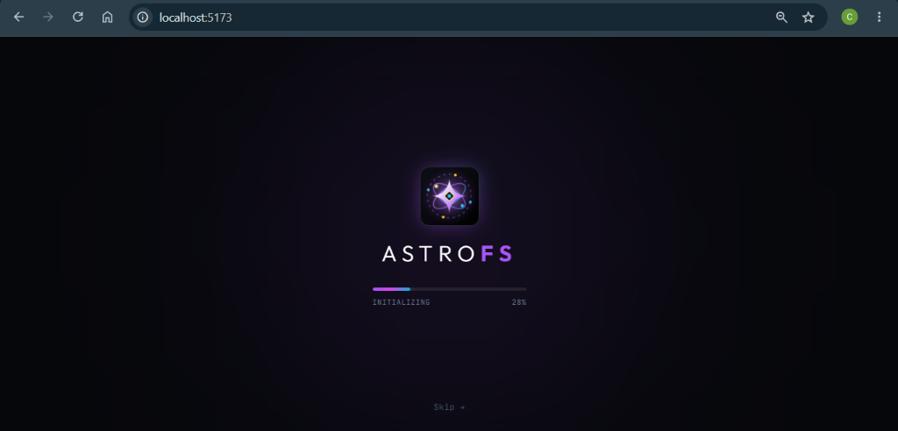
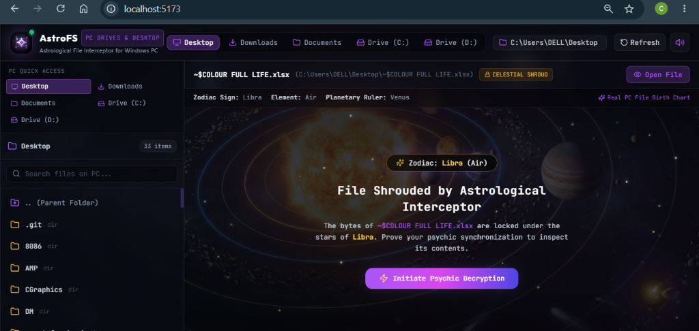
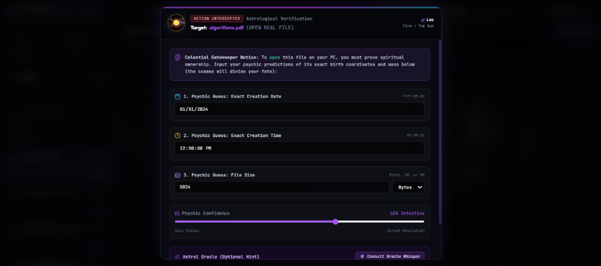
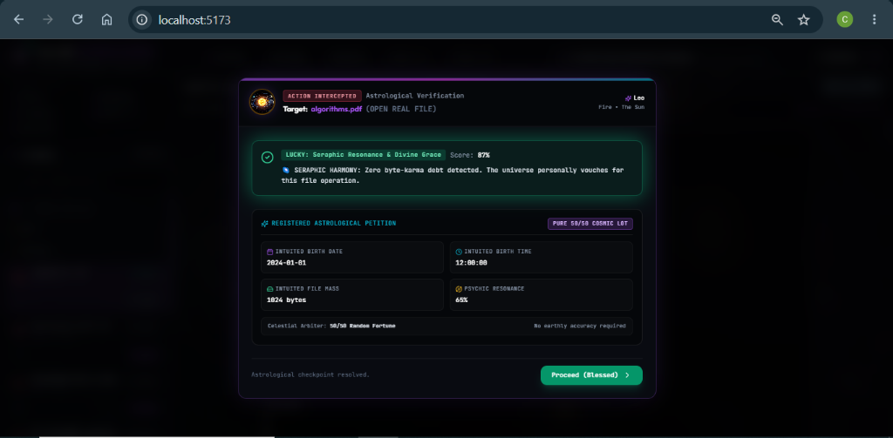
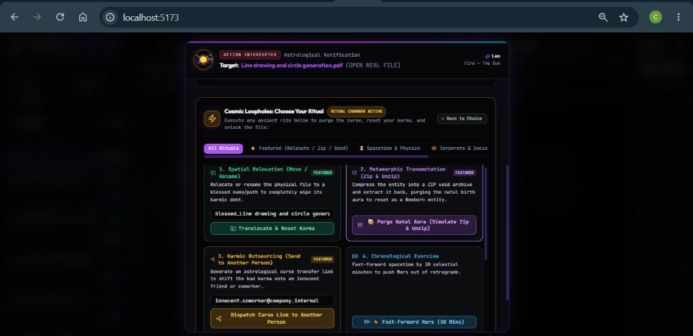

# AstroFS: Astrological File Interceptor 🎯

## Basic Details
### Team Name: CodeCrafters

### Team Members
- Team Lead: Christeena Jestin - School Of Engineering, CUSAT
- Member 2: Angelina Mary George - School Of Engineering, CUSAT

### Project Description
AstroFS is a satirical Windows PC file manager that intercepts every mundane file action (opening or inspecting files) and subjects it to celestial interrogation. Before your operating system lets you view a file, you must submit an astrological petition guessing the file's exact birth date, birth time, byte mass, and psychic confidence. The celestial fate engine then arbitrates your fate with pure 50/50 cosmic chance—granting instant divine access if lucky, or cursing you with doom. If doomed, you must opt for absurd cosmic loop-hole rituals (relocating/renaming the file, transmuting through a ZIP void, or transferring the curse to an unsuspecting coworker) to cleanse its karma and unlock the file.

### The Problem (that doesn't exist)
Modern operating systems are ruthlessly efficient. When you click a file on your computer, Windows instantly opens it in 12 milliseconds without ever asking whether Mercury is in retrograde, whether Mars is causing an astral deadlock on sector 7, or whether your soul is karmically aligned to view a `.json` configuration. Computers have completely stripped the spiritual mysticism, cosmic anxiety, and astrological dread out of managing your Desktop and Downloads folders.

### The Solution (that nobody asked for)
Enter AstroFS—the world's first Astrological File Interceptor. It turns every routine file operation into a dramatic cosmic ritual:
- **Celestial Gatekeeping**: Every attempt to open a file is held hostage until you consult your inner oracle and submit the file's astrological birth chart.
- **Mount Real PC Folders for Hosted Apps**: When accessed on hosted web environments (e.g., Vercel, Netlify, Render), users can click **"Mount PC Folder"** to mount any real local Windows directory directly into the browser using the native File System Access API.
- **Pure 50/50 Cosmic Fate**: No earthly NTFS accuracy required—the celestial arbiter flips a cosmic coin with equal probability (50% Blessed / 50% Doomed).
- **Yes/No Doom Bypass Dialog**: If cursed with cosmic rejection, decide whether to accept defeat or bypass the doom through ancient developer rituals.
- **Absurd Loophole Rituals**: Cleanse karmic debt by spatially relocating/renaming the file, compressing into a metamorphic ZIP void and extracting, or outsourcing the curse to a coworker's email address.
- **Minimalist 4-Second Bootloader**: A sleek, elegant cosmic initialization screen featuring our custom sacred astrolabe logo in Google Font Outfit.

## Technical Details
### Technologies/Components Used
For Software:
- Languages used: JavaScript (ES6+), HTML5, CSS3
- Frameworks used: React 18, Vite 6, Express.js (Node.js)
- APIs & Browser Features: Browser File System Access API (`window.showDirectoryPicker`), Webkit Directory API, Web Audio API (procedural audio synthesizer)
- Libraries used: Tailwind CSS, Lucide React, Canvas Confetti
- Tools used: Git, GitHub, Node.js, npm, VS Code, Antigravity


For Hardware:
-[List main components]
-[List specifications]
-[List tools required]


### Implementation
For Software:
# Installation
```bash
# Clone the repository
git clone https://github.com/ChristeenaJestin/useless_project_temp.git
cd useless_project_temp

# Install server and client dependencies
npm run setup
```

# Run
```bash
# Launch both Express backend (port 5000) and Vite client (port 5173) simultaneously
npm run dev

# Or build client for static cloud hosting (Vercel, Netlify, Render)
npm run build:client
```

### Project Documentation
For Software:

# Screenshots (Add at least 3)

*Cosmic Splash Loader: Minimalist 4-second celestial initialization screen displaying the glowing AstroLogo, Outfit typography, and smooth progress bar.*


*AstroFS Workspace: Real Windows PC file explorer displaying directory folders, celestial shrouding, and astrology birth chart metadata (Zodiac Sign, Element, Planetary Ruler).*


*Astrological Interrogation Modal: Celestial checkpoint prompting the user to submit an astrological petition with intuited creation date, time, file mass, and psychic confidence slider.*


*Seraphic Resonance (Lucky Verdict): Pure 50/50 cosmic lot arbitration granting instant file decryption and displaying the registered astrological petition.*


*Ancient Rituals Chamber: Interactive doom bypass options including Spatial Relocation (move/rename), Metamorphic Transmutation (ZIP/UNZIP), Karmic Outsourcing (send curse to coworker), and Chronological Exorcism.*

# Diagrams

*AstroFS Workflow: Real PC Directory Browse -> File Interception -> Astrological Petition Form -> 50/50 Random Verdict (Lucky: Unlock with Confetti / Doomed: Yes/No Bypass Decision) -> Ancient Ritual Execution -> Karmic Cleansing & File Access*

For Hardware:

# Schematic & Circuit

*N/A - Pure software project*


*N/A - Pure software project*

# Build Photos

*N/A - Pure software project*


*N/A - Pure software project*


*N/A - Pure software project*

### Project Demo
# Video
[Add your demo video link here]
*Video demonstration showcasing file interception, random cosmic fate evaluation, and the ancient loophole bypass rituals.*

# Additional Demos
[Add any extra demo materials/links]

## Team Contributions
- Christeena Jestin: Full-stack architecture, Express local filesystem API, 50/50 astrological fate engine, procedural Web Audio synthesizer, and ritual bypass implementations.
- Angelina Mary Geo: UI/UX design, AstroLogo sacred geometry, Google Font Outfit integration, cosmic splash loader, and astrological lore curation.

---
Made with ❤️ at TinkerHub Useless Projects 


